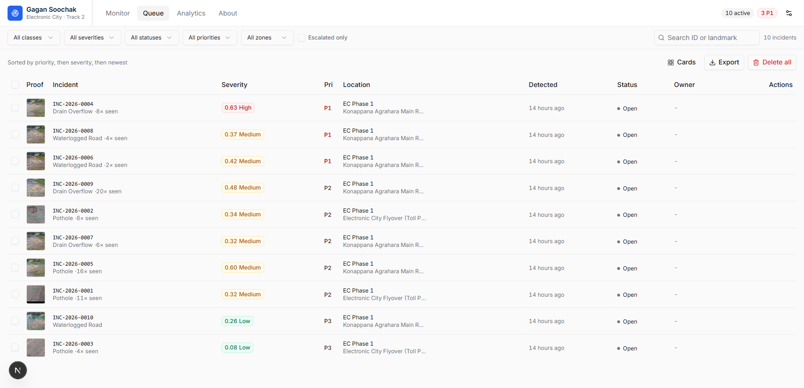

# Gagan Soochak - गगन सूचक

**On-device monsoon-hazard detection and civic repair workflow for Electronic City, Bengaluru.**

Team DuoQueue · ELCIA Smart City Drone-AI Challenge 2026 · Track 2: Monsoon, Roads & Civic Infrastructure

A human operator opens a URL, loads drone/dashcam footage, and watches potholes,
waterlogged roads and drain overflows get detected **in their own browser** - the YOLOv8n
model (~12 MB ONNX) downloads once, is cached, and runs on-device via WebGPU/WASM. Every
detection becomes an incident with full evidence (type, severity + decomposition, location,
timestamp, visual proof), is auto-routed to the responsible department (BBMP Roads / BBMP
SWD / BWSSB), and is tracked through a municipal lifecycle to verified closure - with an
audit trail, escalation, false-positive rejection, and JSON/CSV export.

> **Live demo:** _(Vercel URL here)_ · **5-min video:** _(link here)_



## Why this is different from an AI demo screen

- **Genuinely on-device.** Open DevTools → Network: after the one-time model download,
  nothing leaves the browser. Go offline - detection still works. Judges can drop in their
  own mp4 and watch it detect on footage we never picked. Verified: an uploaded clip is a
  `blob:` URL with **zero** network requests, zero fetch/XHR, zero cross-origin traffic;
  the model is served from Cache Storage with 0 requests on repeat visits.
- **One defect, one work item.** Repeat sightings of the same physical hazard are clustered
  into a single incident with a sightings count and an audit entry - 58 raw detections
  became 4 tickets on one clip, instead of 20 near-duplicates.
- **Same math as the edge pipeline.** The tracker constants, severity formula and
  preprocessing are ported verbatim from `ml/pipeline.py`; `evidence/parity_check.md` shows
  numerically identical model output across both runtimes.
- **A workflow, not a viewer.** Assign → start → resolve (with note) → verify & close;
  reject false positives with a recorded reason; escalate with priority bump; every change
  audit-stamped; everything exportable.

## Quickstart

```bash
npm install
npm run dev        # http://localhost:3000  (predev copies ONNX runtime files)
```

That's it - no Python, no GPU, no env vars. The trained model ships in
`public/models/best.onnx`.

**Try it:** Monitor → pick a sample clip (or drop any road .mp4) → Play. Detections stream
into the Queue; open one to drive the workflow. The `⋯` menu has **Load demo data** (12
seeded incidents, clearly badged) if you want to explore the queue without running video.

### Deploy (Vercel)

Push to GitHub → import the repo in Vercel → deploy. **No configuration and no environment
variables.** Framework preset auto-detects Next.js; `npm run build` triggers the `prebuild`
step that stages the ONNX Runtime binaries.

Verified on a production build (`next build && next start`):

| Check | Result |
|---|---|
| COOP / COEP on all routes | `same-origin` / `require-corp` → `crossOriginIsolated === true` |
| `/models/best.onnx` | `200`, `Cache-Control: public, max-age=31536000, immutable` |
| `/ort/*.wasm` | `200`, immutable |
| Inference in production | WebGPU bound, ~39 ms/frame, 0 console errors |
| Cross-origin requests | none |

`public/ort/` is **generated at build time** by `scripts/copy-ort.mjs` and is gitignored -
do not commit it. Only the two runtime variants the app can bind (WebGPU `jsep` + threaded
WASM fallback) are staged, which keeps ~42 MB out of every deployment. `.vercelignore`
excludes `ml/`, `evidence/` and `docs/` from the upload; they stay in the GitHub repo for
reviewers but are not needed to build or run the dashboard.

## Architecture

```
Browser (everything runs here after page load)
│
├─ MAIN THREAD
│   <video>
│    ├─ setInterval sampling ~30 Hz, act on every Nth tick (N=2 → ~15 Hz)
│    │     └─ createImageBitmap(resize 640×720) ──transfer──▶ Worker
│    └─ requestAnimationFrame: draw tracker.active boxes on <canvas> overlay
│
├─ WEB WORKER (inference.worker.ts)
│   letterbox 640×640 (gray 114 pad) → Float32 NCHW
│   → onnxruntime-web (WebGPU, WASM fallback) → [1,7,8400]
│   → conf ≥ 0.30 → per-class NMS → un-letterbox → detections
│
└─ MAIN THREAD
    HazardTracker (centroid match, ported from pipeline.py)
      └─ severity = 0.6·spatial + 0.4·temporal
           └─ repeat-sighting clustering (same class, <25 m, <30 min)
                └─ Incident store (Zustand)
                     ├─ metadata → localStorage
                     └─ evidence JPEGs → IndexedDB
```

Key modules:

| Path | What |
|---|---|
| `src/lib/detection/constants.ts` | every tunable, transcribed from `pipeline.py` |
| `src/lib/model/{preprocess,postprocess}.ts` | exact two-step transform + decode/NMS |
| `src/lib/detection/{tracker,severity}.ts` | line-for-line ports |
| `src/lib/workflow/*` | lifecycle, routing, priority, response playbook |
| `src/lib/mock/*` | simulated GPS routes + derived timestamps (badged in UI) |
| `ml/` | Python edge pipeline, ONNX export + verification + parity probe |

## Reproducing the model artifacts

Training ran on Colab (YOLOv8n, 100 epochs, 3 Roboflow datasets - see
`ml/Technical_Build_Notes.md`). To re-export the ONNX from the committed weights:

```bash
cd ml
uv venv --python 3.12 && uv pip install ultralytics onnx onnxslim onnxruntime
uv run python export_onnx.py    # best.pt -> best.onnx
uv run python verify_onnx.py    # asserts the I/O contract the web build depends on
```

Pinned versions: `ml/uv.lock`. The original edge pipeline runs with
`uv run python pipeline.py` (set `VIDEO_SOURCE` in the file).

## Evidence fields per incident

Event type · severity score **with spatial/temporal decomposition** · severity level ·
model confidence · priority (P1-P3 with class-aware rules) · location (landmark, zone, ward,
lat/lng - **badged SIMULATED**) · timestamp (**badged DERIVED**: patrol start + video
timecode) · source clip + video position · bounding box · sightings count · owner ·
recommended action (class × severity playbook) · SLA guidance · status · audit trail.

## Measured results

- **Validation mAP50** (20% held-out): pothole **0.893** · waterlogged_road **0.743** ·
  drain_overflow **0.720** - all clear the proposal's 0.70 target. drain_overflow is over
  ~16 validation instances; treat with wide error bars.
- **Browser inference** (dev machine, WebGPU, production build): ~39-58 ms per inference,
  ~30 Hz sampling at N=2. Python CPU baseline: 7.7 FPS unskipped / ~14-15 at N=2.
- **False-alert rate**: **2 of 10 incidents (20%)** on the two bundled clips, labelled
  per-incident against the stored evidence frames - `evidence/false_alert_rate.md`. Both
  errors were `pothole` class below 0.36 confidence; the water/drain classes had none.
- **Clustering**: 141 raw detections became 10 work items (21 repeat sightings merged).
- **Runtime parity**: identical model output across Python and browser to 4-5 significant
  figures - `evidence/parity_check.md`.
- Live session numbers are on the **Analytics** page, clearly separated from training
  metrics.

## What's real vs. simulated

Real & measured: detections, confidences, severity scores, latencies, the full lifecycle +
audit trail. Simulated & disclosed: GPS (interpolated along preset Electronic City patrol
routes), timestamps (patrol start + timecode), department/crew names, SLA hours (guidance,
not timers). Every simulated field is badged in the UI and exported as
`location_source=simulated`. Full table on the in-app **About** page.

## Limitations (honest list)

- **3 of the 4 track classes** - `damaged_footpath` was prepared but is not in the shipped
  model: folding a fourth class into one all-in-one detector pushed it past the CPU
  real-time budget this project targets (the same constraint behind the YOLOv8s → YOLOv8n
  choice). We shipped three classes that run in real time on-device rather than four that
  do not. No footpath accuracy is claimed, because none was measured on a shipped model.
  It leads our future-scope list.
- `drain_overflow` is the weak class (~80 training images); expect false positives - that is
  what the Reject action is for.
- Centroid tracking (no Kalman/re-ID) can confuse two very close same-class defects.
- Repeat-sighting clustering keys on simulated GPS; with real telemetry the radius would
  need tuning against actual position error.
- Single stream; no live RTSP/drone ingest in this build.
- Incident data is per-browser (localStorage + IndexedDB) by design for this evaluation; a
  server DB is a contained swap at the store boundary.
- Not yet tested on official ELCIA-provided footage.

Full methodology + limitations: the in-app **/about** page and `ml/Technical_Build_Notes.md`.

## Team

DuoQueue - _(names + who built what: ML pipeline / dashboard - fill for submission)_
